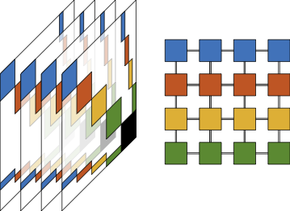

**Schurcheb: A MPI-based Real Symmetric Eigenvalue Solver for Computing Smallest Eigenvalues (Version 1.0.0)**

**Schurcheb** is a MPI-based C++ research code for computing partial spectral factorizations of matrix pencils via Chebyshev approximation.
This is a distributed-memory package for computing all the eigenvalues (and corresponding eigenvectors) of a large, sparse, real symmetric
positive definite matrix pencil that lie within a target interval.
The algorithm is purely algebraic and is based Chebyshev interpolation of the eigenvalues of the Schur
complement (over the interface variables) of a domain decomposition reordering 
of the pencil and accordingly exposes two dimensions of parallelism: one
derived from the reordering and one from the independence of the interpolation nodes.

For questions/feedback send e-mail to Tianshi Xu [xuxx1180@umn.edu]. 

Key Features:
 - Schurcheb is purely algebraic. Only needs the matrix A and M.
 - Schurcheb uses 2D MPI grids for better parallel scalability.
 - Schurcheb does not require the factorization of the mass matrix.

**1. DESCRIPTION OF CONTENTS**

 * SRC
    - utils                             : Utility functions.
       - complex.hpp                    : Complex value for Schurcheb.
       - utils.hpp                      : Basic utility functions.
       - parallel.hpp                   : Basic parallel functions.
       - memory.hpp                     : Memory management.
       - protos.hpp                     : Functions from external packages.
       - mmio.hpp                       : Matrix Market helper functions.
    - vectors                           : Vector functions.
       - vector.hpp                     : Virtual vector classes.
       - int_vector.hpp                 : Integer vector.
       - sequential_vector.hpp          : Sequential real/complex vector.
       - parallel_vector.hpp            : Parallel real/complex vector.
       - vectorops.hpp                  : Vector operations.
    - matrices                          : Matrix functions.
       - matrix.hpp                     : Virtual matrix classes.
       - arnoldimatrix.hpp              : Virtual matrix classes for Krylov methods.
       - coo_matrix.hpp                 : COO matrix class.
       - csr_matrix.hpp                 : CSR matrix class.
       - dense_matrix.hpp               : Dense matrix class.
       - parallel_csr_matrix.hpp        : Parallel CSR matrix class.
       - matrixops.hpp                  : Matrix operations.
    - solvers                           : Solvers.
       - solver.hpp                     : Virtual solver classes.
    - preconditioners                   : Preconditioenrs.
       - ilu.hpp                        : Incomplete LU factorization preconditioners.
    - schurcheb                         : Schur Chebyshev main functions.
       - arpack.hpp                     : ARPACK interface.
       - dsolver.hpp                    : Direct solver wrapper.
       - mumps.hpp                      : MUMPS interface.
       - superlu.hpp                    : SuperLU_dist interface.
       - pardiso.hpp                    : MKL Pardiso interface.
       - schurshift.hpp                 : Class for local Schur complement eigenvalue problems.
       - chebeig.hpp                    : Class for Schue Chebyshev eigenvalue solver.

 * TESTS
    - test_schur.cpp                    : test driver for Schur Chebyshev eigenvalue solver.
    - test_min.cpp                      : a very simple example of the Schurcheb interface.
    - test_parpack.cpp                  : test driver for comparisons.


**2. INSTALLATION**

 * External Packages
    - BLAS and LAPACK are required.
    - ParMETIS is required. Currently we only support domain decomposition via ParMETIS.
    - PARPACK is optional. Linking to it enables the use of implicitly restarted Lanczos.
    - MKL is optional. Linking to it provides faster local solvers for the diagonal blocks of B.
    - MUMPS is optional. Linking to it provides global direct solver options.
    - SUPERLU is optional. Linking to it provides global direct solver options.

 * Install
    - Build the ParMETIS.
    - Edit makefile.in. Set options and the path of external libraries.
    - Make the library with make command.
    - Go to folder TESTS, use make to build test drivers.
    - We provide an example build.sh that works for some Linux systems.

**3. SAMPLE RUNS**
 * test_min.ex
    - mpirun -np 4 ./test_min.ex
       - A sample code.
 * test_schur.ex
    - mpirun -np 1 ./test_schur.ex -help
       - Print usage.
    - mpirun -np 4 ./test_schur.ex -n 65 64 1 -ndom 8 -ncol 2 -nnode 8 -ab 0.0 0.04 -neig 12 -m 24
       - Compute eigenvalues between (0.0 0.04) of a 65*64 2D Laplacian. 
       - We set neig = 12 to compute 12 eigenvalues for each shift, and the restart dimension is 24.
    - mpirun -np 4 ./test_schur.ex -gen -A ./Matrices/Ale2475.mtx -M ./Matrices/Mle2475.mtx -ndom 8 -ncol 2 -nnode 8 -ab 0.0 2.0 -neig 20 -m 40
       - Use -gen option to load general test problems in mtx format (1-based).
       - Solve Av = lv if -M option is not used.
       - Solve Av = lMv if -M option is used.

**4. CALL SCHURCHEB IN C++**

Here we provide a very basic example.
For a very simple interface see test_min.cpp.
For more options please see the test_schur.cpp.

 - Header and namespace 
```
#include "schurcheb.hpp"
using namespace schurcheb;
```

 - Initialize Schurcheb
```
//Only one of the following functions should be used.
//If user do not call MPI_Init, use this function as MPI_Init.
SchurchebInit( &argc, &argv);
//If user call MPI_Init, call this function after MPI_Init.
SchurchebInitMpi(MPI_COMM_WORLD);
```

 - Read mtx matrix into sequential double precision CSR format
```
matrix_csr_double A, M;
A.ReadFromMMFile("a.mtx",1); // (filename, shift)
M.ReadFromMMFile("m.mtx",1);
```

 - Compute eigenvalues
```
// compute neig smallest eigenvalues between [a, b]
// domain decomposition with ndom subdomains
// use nnode Chebyshev nodes and assign Chebyshev nodes to ncol MPI communicators.
// notes:
// ndom should be passed by reference since the value might be changed on return
schurcheb_double eig_solver;
eig_solver.Setup( A, M, neig, a, b, ndom, nnode, ncol);
```

 - Free data structure
```
A.Clear();
M.Clear();
eig_solver.Clear();
```

 - Finalize Schurcheb
```
//Only one of the following functions should be used.
//If user do not call MPI_Fiinalize, use this function as MPI_Fiinalize.
SchurchebFinalize();
//If user call MPI_Fiinalize, call this function before MPI_Fiinalize.
SchurchebFinalizeMpi()
```
